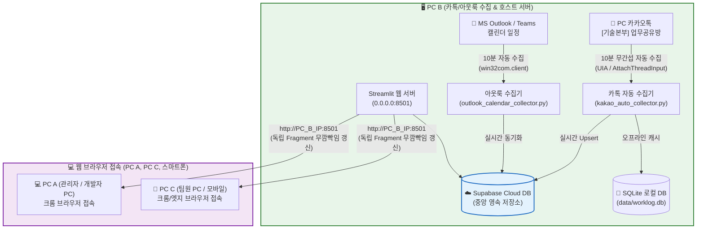

# 🚀 기술본부 카카오톡 & 아웃룩 업무량 및 실시간 분석 대시보드

카카오톡 `[기술본부] 업무공유방`의 **시작/완료 보고 메시지**와 Microsoft Outlook / Teams의 **캘린더 일정**을 10분마다 무간섭 자동 수집하여, **과거시(누적 실적 KPI) ➔ 현재시(LIVE 관제) ➔ 미래시(통합 월간 캘린더)**로 이어지는 완벽한 3단계 시간축 모니터링을 제공하는 **엔터프라이즈급 실시간 업무 관제 대시보드 시스템**입니다.

---

## 🌟 1. 핵심 아키텍처 & 멀티 소스 하이브리드 파이프라인

### 1.1 데이터 수집 및 동기화 구조


| 구분 | 역할 | 주요 동작 |
| :--- | :--- | :--- |
| **PC B (호스트 서버)** | **수집 엔진 & 웹 서버** | PC 카카오톡 채팅창 및 MS 아웃룩 캘린더를 10분 주기로 자동 크롤링/수집하여 Supabase Cloud DB로 동기화하고 Streamlit 서버를 상시 구동. |
| **PC A & C (클라이언트)** | **웹 브라우저 관제** | 별도 클라이언트 설치 없이 웹 브라우저(`http://[호스트_IP]:8501`)로 접속하여 1분 주기 무깜빡임 라이브 관제 및 과거/미래 일정 확인. |

---

## 🧭 2. 대시보드 3단계 시점 편성 (과거시 ➔ 현재시 ➔ 미래시)

화면 배치는 사용자의 인지 흐름에 맞추어 **과거시에서 미래시로 자연스럽게 전개**됩니다:

```
┌─────────────────────────────────────────────────────────────┐
│ 1. [과거시] 핵심 KPI 5대 지표 & 근무 실적 통계             │
│    - 총 투입 시간, 작업 건수, 투입 인원, 긴급 작업, 초과율  │
├─────────────────────────────────────────────────────────────┤
│ 2. [과거~현재] 주 40h / 52h 근무 시간 알림 배너             │
│    - 52h 초과 시 🚨 위험 경고 / 40~51h 주의 모니터링        │
├─────────────────────────────────────────────────────────────┤
│ 3. [현재시] LIVE 관제: 오늘 실시간 작업 및 부재 현황        │
│    - 🏖️ 휴가/부재 현황 + ⏳ 실시간 진행 작업 (1분 자동 갱신)│
│    - ✅ 오늘 완료된 작업 (칸반/그리드)                       │
├─────────────────────────────────────────────────────────────┤
│ 4. [미래시] 월간캘린더 통합 일정표 (동기화: 아웃룩&Teams)   │
│    - 전 팀원 미래 스케줄 고대비 7색 스펙트럼 월간 캘린더    │
└─────────────────────────────────────────────────────────────┘
```

---

## 🎯 3. 세부 판정 내역 및 비즈니스 로직 (Decision Rules)

시스템 내 적용된 정량적 판정 및 데이터 가공 기준은 다음과 같습니다.

### 3.1 출처(Source) 판정 및 화면 뱃지 표출 규칙
작업 데이터의 발생 경로에 따라 실시간 카드 및 완료 카드에 출처 뱃지가 부여됩니다:

| 출처 유형 | 판정 기준 | 전체 팀 뷰 (5열 좁은 화면) | 단일 팀 뷰 (4열 넓은 화면) | 뱃지 디자인 사양 |
| :--- | :--- | :---: | :---: | :--- |
| **카카오톡** | 카카오톡 업무공유방 파싱 데이터 | **`K`** | **`💬 카톡`** | `#FEE500` 노란색 배경, `#371d1e` 다크브라운 폰트, 볼드 |
| **아웃룩/Teams**| MS Outlook / Teams 캘린더 동기화 데이터 (`is_outlook=True`) | **`O`** | **`📅 아웃룩`** | `#0284c7` 블루 배경, `#ffffff` 화이트 폰트, 볼드 |
| **휴가/연차** | `is_leave=True` 또는 '휴가/연차/반차' 키워드 포함 건 | **`🏖️`** | **`🏖️ 휴가`** | `#f3e8ff` 연보라 배경, `#7e22ce` 보라 폰트 |

> **🛡️ 줄바꿈 및 찌그러짐 원천 방지**: 기술본부 전체 5열 칸반 화면처럼 카드 너비가 좁아질 때 글자가 두 줄로 꺾이지 않도록 `white-space: nowrap`, `flex-shrink: 0` 속성이 모든 뱃지와 상하단 컨테이너에 강제 적용됩니다.  
> **💡 범례 안내**: 실시간 보드 헤더에 `⏳ 실시간 진행 중인 작업 ( [K] 카카오톡 | [O] 아웃룩 ) N건` 형태로 상시 안내를 제공합니다.

---

### 3.2 시간 상태 및 특수 근무 판정 규칙

1. **시작 시간 표기 (`time_badge_label`)**:
   - 카톡 시작 건: **`시작보고 HH:MM`** (예: `시작보고 08:30`)
   - 아웃룩 일정 건: **`일정시작 HH:MM`** (예: `일정시작 09:00`)
2. **야간 작업 (`🌙 야간`) 판정**:
   - 작업 시작 시각이 **18:00 ~ 익일 06:00** 사이이거나 메시지에 `[야간]` 태그가 명시된 경우.
   - 주간(06:00~18:00) 작업은 자동 배제.
3. **주말 작업 (`🏖️ 주말`) 판정**:
   - 작업 일자가 **토요일(Saturday)** 또는 **일요일(Sunday)**에 해당하는 경우.
4. **예정 시간 초과 (`⚠️ 초과`) 판정**:
   - `현재 시각(KST) - 작업 시작 시각 > 예정 시간(estimated_hours)` 인 경우 즉시 점등.
   - 프로그레스 바 100% 도달 후 붉은색 경고 점등 및 경과 시간 붉은색 볼드 처리.
5. **마우스 오버 툴팁 (Hover Tooltip)**:
   - 카드 가로 폭 축소로 긴 고객사명이나 작업 내용이 말줄임표(`...`) 처리되더라도, 마우스를 올리면 `title` 속성을 통해 **전체 원문이 툴팁으로 즉시 노출**.

---

### 3.3 과중 근무 (주 40h / 52h) 2단계 알림 판정 규칙

근로기준법 및 본부 운영 가이드에 따라 **2단계 경고 시스템**을 적용합니다:

```
[총 근로시간]
0h ────────────── 40.0h ────────────────── 52.0h ─────────────▶ (시간)
      정상 근무           주 40h~51.9h (주의)         주 52h 이상 (위험)
  [과중 근무 없음]     ⚠️ [근무 시간 경고]          🚨 [과중 근무 발생 알림]
   (초록색 배너)       (주황색 배너 & 버튼)        (빨간색 플래시 배너 & 버튼)
```

1. **법정 실근로시간 정밀 산정 (공제 원칙)**:
   - 카카오톡 `[교육]` 태그 건 및 `[휴가/연차]` 건은 일반 활동 통계에는 기록되나, **주 40h/52h 법정 근로시간 산정에서는 100% 자동 제외(공제)**.
2. **1단계: 주 40시간 ~ 51.9시간 (세이프 범위 내 주의/경고)**:
   - 법정 한도(52시간) 내이지만 연장근로 관리가 필요한 상태.
   - **배너**: `⚠️ [근무 시간 경고] 선택 기간 내 주 40시간 초과 팀원이 감지되었습니다. (40~51h 관리 경고)` (주황색 테마)
   - **버튼 칩**: `⚠️ 팀원명(주차:XX.Xh)` 주황색 버튼 표출.
3. **2단계: 주 52시간 이상/초과 (법정 한도 초과 위험)**:
   - 52.0시간을 초과한 인원이 발생한 경우에만 위험 경보 발령.
   - **배너**: `🚨 [과중 근무 발생 알림] 선택 기간 내 주 52시간 초과 팀원이 감지되었습니다! (법정 한도 초과)` (붉은색 네온 사이렌 테마)
   - **버튼 칩**: `🚨 팀원명(주차:XX.Xh)` 붉은색 강조 버튼 표출.
4. **보상 휴가 처리 연동 (`RewardLeaveService`)**:
   - 초과 근무에 대해 대체휴무/보상휴가가 지급 승인된 건은 `✅ 보상 완료` 초록색 칩으로 전환.
5. **초과자 전무 시**:
   - `🟢 [과중 근무 없음] 현재 선택된 기간 내에 주 40시간을 초과한 과중 근무 팀원이 없습니다. (안정적인 근무 상태)` 표시.

---

### 3.4 카카오톡 메시지 파싱 및 시작-완료 매칭 규칙

#### A. 메시지 형식 및 처리 매핑
| 분류 | 수집 형식 예시 | 내부 상태 | 설명 |
| :--- | :--- | :---: | :--- |
| **시작 보고 (Start)** | `작업 / 홍길동 / 수협은행 / 방화벽 점검 / 4시간예정` | `PENDING` | 실시간 관제 보드에 프로그레스 바 카드 생성 |
| **완료 보고 (End)** | `4시간 완료` 또는 `홍길동 4시간 완료` | `COMPLETED` | 대기 중인 PENDING 건을 찾아 실제 시간으로 결합 |
| **단발성 완료 (Direct)**| `작업 / 홍길동 / 수협은행 / 긴급패치 / 2시간 완료` | `COMPLETED` | 시작/완료가 1문장에 포함되어 즉시 완료 처리 |
| **다일(Multi-day) 작업**| `작업 / 홍길동 / BGF / 상주지원 / 3days` | `PENDING` | 1일 9시간(540분) 기준으로 일자별 레코드로 전개 분할 |

#### B. 필드 추출 및 정규화
- **작업자 분할**: `홍길동, 김철수` 또는 `홍길동/김철수` 기재 시 각각 1인 1건의 독립 레코드로 자동 복제 전개.
- **고객사명 정규화**: `(주)농협정보시스템`, `농협정시`, `NH정보시스템` ➔ **`농협정보시스템`**으로 단일 매핑.
- **소요시간 스케일 매칭 가드**: `2시간 예정`과 `9시간 예정`이 동시에 떠 있을 때 `11시간 완료`가 올라오면 스케일이 일치하는 9시간 예정 건에 스마트 매칭.
- **스마트 자동 완료 (Dynamic Auto-Complete)**:
  - 단일 작업: 완료 누락 시 **48시간** 경과 후 예정시간 기준으로 자동 완료 처리.
  - 다일 작업(`N days`): **`max(48h, (일수 × 24h) + 48h)`** 동안 PENDING을 유지하여 실제 완료 보고 수신 보장.

---

### 3.5 아웃룩/Teams 캘린더 연동 및 중복 처리 규칙

1. **한국 표준시(KST) 실시간 동적 동기화**:
   - time.bora.net(LGU+ 타임서버) NTP 기준 KST 시각을 실시간 조회하여 '오늘' 일자를 정확하게 판별 (자정 통과 시 자동 갱신).
2. **카톡-아웃룩 중복 데이터 보존 및 듀얼 뱃지 표출 정책**:
   - 동일 일정이 카톡과 아웃룩 양쪽에 모두 등록된 경우, **DB에는 두 출처 데이터가 모두 보존**됩니다 (기록 무결성).
   - 실시간 현장 지원 현황 카드(진행 중 및 오늘 완료)에서는 카톡과 아웃룩 양쪽에 모두 등록된 일정임을 직관적으로 식별할 수 있도록 **`[K][O]`(단일 팀 뷰: `[💬 카톡][📅 아웃룩]`) 듀얼 뱃지**를 나란히 동시 표출합니다.
   - 월간 캘린더 위젯 표출 시에는 작업자명, 제목, 시작일시 기준 중복 제거(`drop_duplicates`)를 거쳐 1건으로 정갈하게 노출.
3. **팀원별 고대비 7색 스펙트럼**:
   - 문영민(에메랄드 그린), 이동우(코발트 블루), 전종필(브라이트 오렌지), 김시우(바이올렛), 김경현(크림슨 레드), 홍정표(민트 틸), 김형일(골드 옐로우) 등 팀원별 식별이 명확한 대비 색상 적용.
   - 작업자 이름만 `<b>[이름]</b>` 볼드 처리하여 가독성 극대화.

---

## 📁 4. 프로젝트 디렉토리 구조

```
work-time-dashboard/
├── src/
│   ├── dashboard/                  # 프론트엔드 대시보드 레이어
│   │   ├── app.py                  # 진입점 및 3분할 프레임 오케스트레이션
│   │   ├── common/                 # 공통 UI 컴포넌트 & 다이얼로그
│   │   │   ├── dialogs.py          # KPI 상세 팝업 및 발송 모달
│   │   │   ├── styles.py           # 글래스모피즘 CSS 스타일시트
│   │   │   └── ui_helpers.py       # 실시간 카드, 배지, KST NTP 헬퍼
│   │   └── views/                  # 기능별 화면 뷰
│   │       ├── home_view.py        # 🏠 실시간 분석 메인 뷰 (KPI+과중배너+LIVE관제)
│   │       ├── outlook_calendar_widget.py # 📅 월간 통합 캘린더 위젯
│   │       ├── summary_view.py     # 📊 업무 실적 Summary & AI 브리핑
│   │       ├── team_view.py        # 🏢 팀별 현황 및 칸반 보드
│   │       ├── worker_view.py      # 👤 팀원별 공수 및 주차별 히트맵
│   │       ├── client_view.py      # 🏢 고객사별 투입 공수 파레토 분석
│   │       └── settings_view.py    # ⚙️ 시스템 설정 및 부서/직급 매핑
│   ├── collector/                  # 수집 엔진 레이어
│   │   ├── kakao_auto_collector.py # 카카오톡 Windows UIA 무간섭 수집기
│   │   └── outlook_calendar_collector.py # MS Outlook MAPI 캘린더 수집기
│   ├── services/                   # 비즈니스 로직 레이어
│   │   ├── schedule_sync_service.py # 카톡-아웃룩 교차 분석 및 정합성 엔진
│   │   ├── ai_briefing_service.py  # Gemini AI 팩트 추출 및 브리핑 생성기
│   │   ├── email_report_service.py # 반응형 HTML 메일 및 엑셀 리포트 생성
│   │   ├── reward_leave_service.py # 대체/보상휴가 관리 서비스
│   │   └── team_service.py         # 부서, 직급 및 조직 데이터 서비스
│   └── database/                   # 데이터베이스 영속성 계층
│       ├── supabase_client.py      # Supabase Cloud 클라이언트 (PostgreSQL)
│       └── sqlite_client.py        # 로컬 SQLite 캐시
└── README.md                       # 시스템 기술 및 운영 명세서
```

---

## 🛠️ 5. 실행 및 운영 가이드

### 5.1 필수 환경
- **운영체제**: Windows 10 / 11 (PC B 수집기 가동 필수)
- **Python 버전**: Python 3.10 이상
- **의존성 설치**:
  ```bash
  pip install -r requirements.txt
  ```

### 5.2 실행 방법
1. **대시보드 웹 서버 실행**:
   ```bash
   streamlit run src/dashboard/app.py --server.port 8501 --server.address 0.0.0.0
   ```
2. **카카오톡 무간섭 자동 수집기 실행 (PC B)**:
   ```bash
   python src/collector/kakao_auto_collector.py
   ```
3. **아웃룩 캘린더 자동 수집기 실행 (PC B)**:
   ```bash
   python src/collector/outlook_calendar_collector.py
   ```
