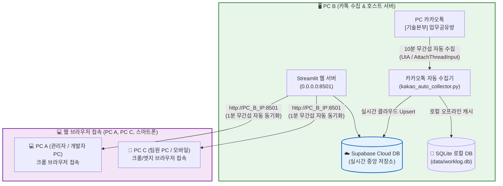

# 🚀 기술본부 카카오톡 업무량 & 지원 시간 실시간 분석 대시보드

카카오톡 `[기술본부] 업무공유방`에 실시간으로 올라오는 **시작/완료 작업 보고 메시지를 10분마다 무간섭으로 자동 수집**하여, **팀원별 공수(시간), 주차별 과중 근무(주 40h/52h), 야간/주말 긴급 작업, 고객사별 투입 통계**를 실시간 분석하고 관제하는 **스마트 웹 대시보드 시스템**입니다.

---

## 🌟 핵심 아키텍처 & 3단계 멀티 PC 운영 구조



| 구분 | 역할 | 설명 |
| :--- | :--- | :--- |
| **PC B (호스트 서버)** | **카톡 수집 & 메인 서버** | PC 카톡 대화방을 열어두고 10분마다 자동 수집하며, Streamlit 대시보드 서버를 가동합니다. |
| **PC A & PC C (클라이언트)** | **웹 브라우저 실시간 조회** | 별도 프로그램 설치 없이 `http://[PC_B_IP]:8501` 주소로 접속하여 1분 자동 동기화로 모니터링합니다. |

---

## 🎯 주요 기능 및 특징

### 1. 🤖 10분 주기 카카오톡 무간섭 자동 수집기
- **100% 무간섭 UIA 직접 읽기**: 작업자의 화면 마우스/키보드 조작을 일체 방해하지 않고 백그라운드에서 안전하게 텍스트 추출.
- **4중 다층 안전 엔진**: Windows OS 레벨 `AttachThreadInput` 포커스 제어 및 네이티브 `keybd_event` 클립보드 복사 Fallback 탑재.
- **초 단위 실시간 라이브 타이머**: `⏳ 9분 45초 뒤 자동수집` 초 단위 실시간 카운트다운 표출 (`st.components.v1.html`).
- **중복 실행 원천 차단**: 토큰 기반 싱글톤 데몬 루프 및 COM `CoInitialize` 예외 완벽 방어.

### 2. ☁️ Supabase Cloud DB & SQLite 하이브리드 동기화
- **Zero-Config 무설정 자동 연결**: `.env` 파일이 없어도 기본 공용 접속 정보로 Supabase 클라우드에 100% 자동 연결.
- **다중 PC 실시간 동기화**: PC B가 긁어온 데이터가 즉시 Supabase로 올라가 모든 팀원 PC에 실시간 반영.
- **오프라인 안전 백업**: 네트워크 단절 시 로컬 SQLite(`data/worklog.db`)로 자동 전환되어 데이터 유실 방지.

### 3. ⏱️ 1분 무간섭 자동 화면 갱신 & 필터 설정 100% 유지
- **F5 없는 실시간 관제**: 대시보드를 모니터에 띄워두면 60초마다 스스로 Supabase 최신 데이터를 감지하여 자동 갱신.
- **핵심 조회 기준 영구 보존**: 사용자가 선택한 **기간, 소속팀, 팀원, 직급, 야간/주말 필터 설정이 리프레시 시에도 절대 초기화되지 않고 100% 그대로 유지**.

### 4. 🚨 스마트 과중 근무 모니터링 & 원클릭 보상휴가 연동
- **과중 근무자 발생 시**: 시선 집중 네온 플래시 깜빡임 + 주 40h(주황색)/52h(빨간색) 초과 칩 버튼 표출.
  - 칩 버튼 클릭 시 **해당 팀원의 주차별 상세 작업 내역 + 카톡 원본 대화 + 보상휴가(대휴/반차) 등록 팝업** 즉시 호출.
- **과중 근무자 미발생 시**: 1:1 완벽 대칭 패딩의 차분한 에메랄드 그린 `[🟢 과중 근무 없음]` 카드 배너 상시 유지.

### 5. 📊 5대 프리미엄 분석 탭 및 시각화
1. **👤 팀원별 업무량 분석**: 팀원별 총 작업시간, 업무 집중도, 주차별 40h/52h 초과 누적 공수, 야간/주말 상세.
2. **🏢 팀별 업무량 비교**: 기술 1팀, 기술 2팀, 기술 3팀, PI팀 간 투입 공수 및 인당 평균 시간 비교.
3. **📈 월별/일별 추이**: 시간 흐름에 따른 업무량 증감 및 특정 일자별 집중도 분석.
4. **🏢 고객사별 공수 분포**: 고객사별 지원 시간 비중 및 주 담당자 분석.
5. **⏱️ 예정 vs 실제 소요시간**: 예상 시간 대비 실제 작업 시간 오차율 분석.

### 6. 👥 팀원 소속/직급 관리 & 대화 파일(.txt) 수동 업로드
- 사이드바에서 팀원별 소속팀(기술 1/2/3팀, PI팀) 및 직급(사원/대리/과장/수석) 실시간 수정 및 클라우드 동기화.
- 카카오톡 내보내기 대화 텍스트 파일(`.txt`)을 드래그&드롭하여 과거 수개월 치 데이터를 1초 만에 일괄 동기화.

---

## 📁 프로젝트 폴더 구조

```
work-time-dashboard/
├── .streamlit/
│   └── config.toml               # 외부 PC 브라우저 접속 허용 (CORS/포트 설정)
├── data/
│   └── worklog.db                # 로컬 SQLite 오프라인 백업 DB
├── src/
│   ├── collector/
│   │   └── kakao_auto_collector.py # 10분 주기 카카오톡 무간섭 수집 데몬
│   ├── config.py                 # 환경 변수 및 Supabase 설정 (Zero-Config)
│   ├── dashboard/
│   │   └── app.py                # Streamlit 프리미엄 대시보드 메인 앱
│   ├── database/
│   │   └── supabase_client.py    # Supabase & SQLite 하이브리드 DB 매니저
│   ├── parser/
│   │   ├── kakao_parser.py       # 카카오톡 메시지 정규식 파서
│   │   └── reply_matcher.py      # 시작-완료 답장 매칭 및 야간/주말 판별기
│   └── services/
│       ├── reward_leave_service.py # 보상 휴가(대휴/반차) 관리 서비스
│       ├── stats_service.py      # KPI 및 통계 연산 엔진
│       └── team_service.py       # 팀원 소속/직급 매핑 서비스
├── setup_and_run.bat             # [최초 실행] 패키지 점검 & 대시보드 실행
├── update_and_run.bat            # [원클릭 업데이트] 기존 프로세스 정리 -> git pull -> 실행
├── sync_to_supabase.py           # 로컬 데이터를 Supabase로 일괄 업로드하는 도구
├── verify_live_supabase.py       # Supabase 실시간 CRUD 전수 검증 도구
├── supabase_schema.sql           # Supabase SQL Editor용 테이블 스키마 DDL
├── requirements.txt              # 필수 파이썬 라이브러리 목록
└── README.md                     # 시스템 종합 가이드 문서
```

---

## 🚀 빠른 시작 가이드 (Quick Start)

### 🖥️ PC B (실제 카톡 수집 & 호스트 서버 PC)

1. **저장소 클론**:
   ```cmd
   git clone https://github.com/newprim82/PublicRepo.git
   cd PublicRepo
   ```
2. **원클릭 실행**:
   - 폴더 안의 **`setup_and_run.bat`** (또는 **`update_and_run.bat`**)을 더블 클릭합니다.
   - 기존 프로세스가 자동으로 정리되고, 필수 라이브러리 설치 후 대시보드가 열립니다.
3. **카카오톡 창 열어두기**:
   - PC 카카오톡에서 **`[기술본부] 업무공유방`** 채팅방 창을 더블클릭하여 화면 한구석에 띄워둡니다.
   - 10분마다 자동으로 최신 대화를 긁어와 Supabase 클라우드에 실시간 저장합니다.

---

### 💻 PC A & PC C (다른 팀원 PC / 모바일)

1. **아무런 프로그램도 설치할 필요가 없습니다!**
2. 웹 브라우저(크롬, 엣지, 사파리 등) 주소창에 호스트 PC의 IP 주소를 입력합니다:
   ```
   http://[PC_B의_IP주소]:8501
   (예: http://172.16.6.126:8501)
   ```
3. 화면을 띄워두시면 **1분마다 설정한 필터를 그대로 유지하면서 최신 데이터가 저절로 갱신**됩니다!

---

## 🛠️ 유지보수 및 유용한 도구

| 스크립트 | 설명 |
| :--- | :--- |
| **`update_and_run.bat`** | 기존 대시보드 프로세스를 안전하게 종료하고, GitHub에서 최신 코드를 pull 받아 새로 실행합니다. |
| **`python sync_to_supabase.py`** | 로컬 SQLite에 있는 전체 데이터를 Supabase 클라우드로 즉시 일괄 업로드합니다. |
| **`python verify_live_supabase.py`** | Supabase 클라우드와의 실시간 쓰기/읽기 양방향 연결 상태를 전수 검증합니다. |

---

## 📄 라이선스 및 문의
- 본 시스템은 기술본부 내부 업무 효율화 및 실시간 작업 관제를 위해 제작되었습니다.
