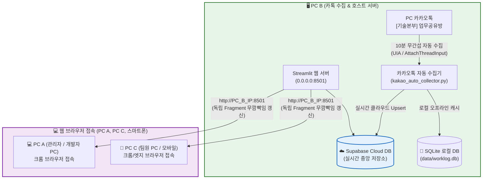
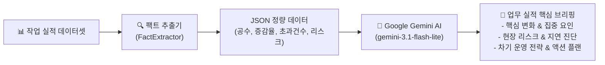

# 🚀 기술본부 카카오톡 업무량 & 지원 시간 실시간 분석 대시보드

카카오톡 `[기술본부] 업무공유방`에 실시간으로 올라오는 **시작/완료 작업 보고 메시지를 10분마다 무간섭으로 자동 수집**하여, **팀원별 공수(시간), 주차별 법정근로시간(주 40h/52h), 야간/주말 긴급 작업, 고객사별 투입 통계, 업무 실적 Summary**를 실시간 분석하고 관제하는 **엔터프라이즈급 스마트 웹 대시보드 시스템**입니다.

---

## 🌟 1. 핵심 아키텍처 & 3단계 멀티 PC 운영 구조

### 1.1 하이브리드 동기화 파이프라인


| 구분 | 역할 | 설명 |
| :--- | :--- | :--- |
| **PC B (호스트 서버)** | **카톡 수집 & 메인 서버** | PC 카톡 대화방을 열어두고 10분마다 자동 수집하며, Streamlit 대시보드 서버를 상시 가동합니다. |
| **PC A & PC C (클라이언트)** | **웹 브라우저 실시간 조회** | 별도 프로그램 설치 없이 `http://[PC_B_IP]:8501` 주소로 접속하여 실시간 동기화 모니터링을 진행합니다. |

---

### 1.2 모듈형 클린 아키텍처 (Clean Architecture Refactored)
과거 단일 파일(`app.py`) 구조에서 발생하던 성능 병목과 복잡도를 해소하기 위해, **관심사 분리(Separation of Concerns)** 원칙에 따라 전문 디렉토리 구조로 완전 분리되었습니다:

```
work-time-dashboard/
├── src/
│   ├── dashboard/                  # 프론트엔드 대시보드 레이어
│   │   ├── app.py                  # 진입점 및 3분할 프레임 오케스트레이션
│   │   ├── common/                 # 공통 컴포넌트 & 모달
│   │   │   ├── dialogs.py          # 메일 발송 팝업 모달 (최근 5회 DB 이력 표출)
│   │   │   ├── styles.py           # 글래스모피즘 전용 CSS 스타일
│   │   │   └── ui_helpers.py       # 직급 정렬, KST 시간 변환, 배지 헬퍼
│   │   ├── views/                  # 탭별 독립 뷰 모듈
│   │   │   ├── summary_view.py     # 📊 업무 실적 Summary & AI 브리핑
│   │   │   ├── team_view.py        # 🏢 팀별 현황 및 칸반 보드
│   │   │   ├── worker_view.py      # 👤 팀원별 공수 및 주차별 히트맵
│   │   │   ├── client_view.py      # 🏢 고객사별 투입 공수 파레토 분석
│   │   │   ├── anomaly_view.py     # ⚠️ 초과/지연/이상징후 모니터링
│   │   │   ├── trend_view.py       # 📈 월별/일별 투입 추이 분석
│   │   │   └── settings_view.py    # ⚙️ 시스템 설정 및 팀 매핑 관리
│   ├── services/                   # 백엔드 핵심 비즈니스 로직
│   │   ├── ai_briefing_service.py  # Google Gemini Flash REST API 연동 & 팩트 추출기
│   │   ├── email_report_service.py # 반응형 HTML 이메일 & 다중 시트 엑셀 생성
│   │   ├── email_sender.py         # Gmail SMTP 안전 발송기 (SSL/TLS Fallback)
│   │   ├── email_dispatch_service.py # 메일 발송 이력 하이브리드 DB 로깅
│   │   └── team_service.py         # 팀 매핑 및 부서 데이터 관리
│   ├── database/                   # 영속성 계층
│   │   ├── supabase_client.py      # Supabase 클라우드 클라이언트 (Multi-PC Sync)
│   │   └── sqlite_client.py        # 로컬 SQLite 캐시 저장소
│   └── scripts/                    # 주기적 자동화 배치 스크립트
│       └── send_weekly_report.py   # 주간/월간 자동 보고서 CLI 배치
```

---

## 🔍 2. 카카오톡 메시지 파싱 내용 / 방법 / 기준

시스템은 정규식 파서와 스마트 매칭 엔진을 통해 비정형 카카오톡 메시지를 구조화된 작업 로그 데이터로 변환합니다.

### 2.1 수집 대상 메시지 포맷 및 분류 기준
| 분류 | 메시지 형식 예시 | 처리 방식 |
| :--- | :--- | :--- |
| **시작 보고 (Start)** | `작업 / 홍길동 / 수협은행 / 방화벽 점검 / 4시간예정` | 작업 상태를 `PENDING(진행 중)`으로 등록 |
| **완료 보고 (End)** | `4시간 완료` 또는 `홍길동 4시간 완료` | 대기 중인 PENDING 건을 찾아 `COMPLETED(완료)`로 병합 |
| **단발성 완료 (Direct)** | `작업 / 홍길동 / 수협은행 / 긴급패치 / 2시간 완료` | 시작과 완료가 1줄에 있으므로 즉시 `COMPLETED`로 단독 생성 |
| **다일(Multi-day) 작업**| `작업 / 홍길동 / BGF / 상주지원 / 3days` | 1일 9시간 기준으로 일자별 레코드로 자동 분할 저장 |

### 2.2 시작 보고 필드 추출 규칙 (Slash 구분자 파싱)
`[구분] / [작업자] / [고객사] / [작업 내용] / [예정 시간]`

1. **구분 (`log_type`)**:
   - `작업`, `지원`, `기타`, `회의`, `교육`, `이동`, `정기점검`, `프로젝트`, `사내업무` 등.
   - *(💡 `[교육]`으로 등록된 시간은 일반 활동 통계에는 기록되나, **주 40h/52h 법정 근로시간 과중 산정에서는 100% 자동 제외**됩니다.)*
2. **작업자 (`worker_name`) & 복수 인원 분할**:
   - `홍길동, 김철수`, `홍길동/김철수` 처럼 기재된 경우 **각각 독립된 개별 작업 레코드로 자동 복제 분할(1:N 전개)**.
3. **고객사명 (`client_name`) & 자동 정규화**:
   - `(주)농협정보시스템`, `농협정시`, `NH정보시스템` ➔ **`농협정보시스템`**으로 자동 단일화.
4. **예정 시간 (`estimated_minutes`) 변환**:
   - **`1day` = `9시간` (`540분`)** 기준 적용 (`2days` ➔ 18시간).
   - `4시간`, `4h`, `4.5시간` ➔ 해당 시간 × 60분.

### 2.3 시작-완료 스마트 매칭 가드 (Reply Matcher)
1. **타임라인 기반 1:1 결합**: 작업자별로 올라온 PENDING 건에 완료 보고의 실제 소요시간을 결합하여 `COMPLETED`로 변경.
2. **소요시간 스케일 정합성 가드**: `2시간 예정`과 `9시간 예정`이 대기 중일 때 `11시간 완료`가 올라오면 스케일이 부합하는 9시간 예정 작업에 우선 매칭.
3. **스마트 유동적 자동 완료 (Dynamic Auto-Complete)**:
   - 일반 당일 작업(≤ 9h): 완료 보고 누락 시 **48시간** 후 예정시간 기준 자동 완료.
   - 다일 장기 작업(예: `3days`): **`max(48h, (일수 × 24h) + 48h)`** 공식에 따라 120시간 동안 PENDING을 유지하여 실제 완료 보고와 정상 결합.

---

## 🖥️ 3. 화면 표시 내용 및 무깜빡임(Zero-Flicker) UX

### 3.1 3분할 독립 프레임 격리 아키텍처
기존 전체 리렌더링 방식으로 인한 화면 흔들림을 방지하기 위해 3단계 프레임으로 격리되어 동작합니다:
1. **좌측 네비게이션 프레임 (`render_sidebar_navigation`)**: 팀 선택, 분석 뷰 메뉴 전환.
2. **상단 대제목 헤더 프레임 (`render_top_header_frame`)**: 최상단 대시보드 타이틀 및 글로벌 기간 필터 고정.
3. **본문 컨텐츠 프레임 (`render_main_content_frame`)**: 선택된 뷰별 독립 렌더링.

### 3.2 🟢 진행 중인 작업 카드만 1분 주기 독립 리런 (`@st.fragment(run_every="60s")`)
* 대시보드 전체나 상단 헤더, 사이드바를 다시 그리지 않고, **오직 실시간으로 진행 중인 작업 카드 구역만 1분마다 백그라운드 단독 리런**됩니다.
* 실시간 경과 시간(`⏱️ 경과: X.Xh`)과 프로그레스 바(Shimmer 애니메이션)가 1분마다 무깜빡임으로 자동 갱신됩니다.
* 예정 시간 초과 시 `⚠️ 초과` 붉은색 경고가 즉시 점등됩니다.

### 3.3 🚨 스마트 과중 근무(주 40h/52h) 모니터링
* **교육 시간 100% 자동 차감**: 근로기준법 및 본부 운영 원칙에 의거, `[교육]` 시간은 주 40h/52h 산정에서 제외된 순수 실근로시간 기준으로 엄격 판정.
* **주 40h 초과 (주의)**: 오렌지색 배너 & 칩 표시.
* **주 52h 초과 (위험)**: 붉은색 네온 플래시 깜빡임 배너 표시.
* **원클릭 상세 드릴다운**: 칩 클릭 시 해당 주차의 일자별 상세 원장 및 카톡 원문 즉시 열람.

---

## 📊 4. 업무 실적 Summary & Gemini AI 심층 브리핑

전사 팀원 및 누구나 편안하게 공유하고 확인할 수 있는 종합 보고 뷰입니다 (`Executive/경영진/임원` 단어 전면 배제).



* **🏛️ 핵심 실적 5초 펄스 카드**: 총 투입 공수, 1인당 평균 공수, 지원 고객사 수, 공수 예측 준수율 (전기 대비 MoM/WoW Delta 배지 탑재).
* **🤖 Google Gemini AI 심층 브리핑**:
  - `gemini-3.1-flash-lite` 초고속 모델 연동.
  - 단순 수치 나열을 넘어 정량 팩트 기반의 살아있는 현장 분석 및 액션 플랜 도출.
* **인력 운영 건전성 & 고객사 파레토 분석**: 부서별 공수 집계, 주차별 종합 비교 매트릭스, 상위 고객사 점유율 시각화.

---

## 📧 5. 반응형 이메일 리포트 & DB 발송 이력 관리

### 5.1 원클릭 이메일 발송 & 엑셀 자동 첨부
* **대시보드와 100% 일치하는 반응형 HTML 본문**: 모바일 및 PC 메일 클라이언트(Gmail, Outlook 등) 완벽 대응.
* **메일 발송 시 Gemini AI 심층 브리핑 100% 강제 탑재**:
  - 수동 즉시 발송 팝업 모달이든 스케줄러 자동 발송이든, 발송 시점에 **Google Gemini AI를 직접 호출하여 최신 AI 심층 브리핑(`✨ Gemini AI 심층 분석`)을 메일에 반영**.
* **다중 시트 엑셀 파일 자동 첨부 (`Work_Summary_YYYYMMDD.xlsx`)**:
  - Sheet 1: 상세 작업 원장 로그
  - Sheet 2: 팀별/주차별 인력 운영 집계표
  - Sheet 3: 고객사별 지원 공수 및 점유율

### 5.2 💾 메일 발송 이력 하이브리드 DB 로깅 & 최근 5회 내역 표출
* **하이브리드 로깅 (`EmailDispatchService`)**:
  - 발송 유형(`MANUAL_IMMEDIATE`, `AUTO_WEEKLY`, `AUTO_MONTHLY`) 전수를 로컬 SQLite(`email_dispatch_logs`)와 Supabase Cloud DB(`worktime_email_dispatch_logs`)에 동시 기록.
* **발송 팝업 모달 내 실시간 이력 표출**:
  - 메일 발송 모달을 열면 하단에 **최근 5회 발송 이력 테이블**이 즉시 표출되어 중복 발송을 방지하고 이력을 투명하게 관리.
  - 발송 시각은 타임존 오프셋(`+00`) 없는 **한국 표준시 초단위(YYYY-MM-DD HH:MM:SS)**로 명확하게 표시.

