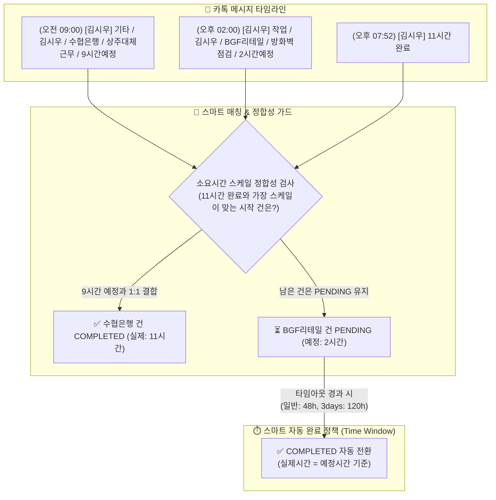
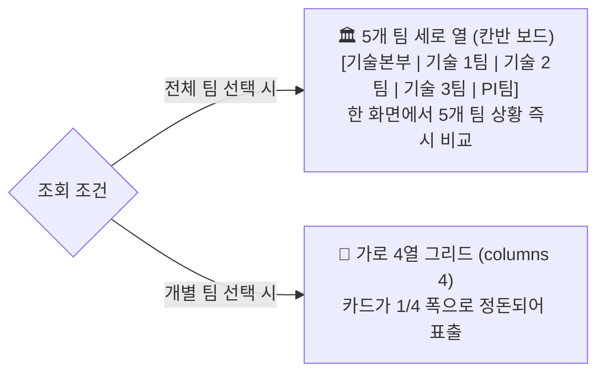

# 🚀 기술본부 카카오톡 업무량 & 지원 시간 실시간 분석 대시보드

카카오톡 `[기술본부] 업무공유방`에 실시간으로 올라오는 **시작/완료 작업 보고 메시지를 10분마다 무간섭으로 자동 수집**하여, **팀원별 공수(시간), 주차별 과중 근무(주 40h/52h), 야간/주말 긴급 작업, 고객사별 투입 통계**를 실시간 분석하고 관제하는 **엔터프라이즈급 스마트 웹 대시보드 시스템**입니다.

---

## 🌟 1. 핵심 아키텍처 & 3단계 멀티 PC 운영 구조


| 구분 | 역할 | 설명 |
| :--- | :--- | :--- |
| **PC B (호스트 서버)** | **카톡 수집 & 메인 서버** | PC 카톡 대화방을 열어두고 10분마다 자동 수집하며, Streamlit 대시보드 서버를 상시 가동합니다. |
| **PC A & PC C (클라이언트)** | **웹 브라우저 실시간 조회** | 별도 프로그램 설치 없이 `http://[PC_B_IP]:8501` 주소로 접속하여 1분 자동 동기화로 모니터링합니다. |

---

## 🔍 2. 카카오톡 메시지 파싱 내용 / 방법 / 기준 (상세 명세)

시스템은 `kakao_parser.py` 정규식 파서와 `reply_matcher.py` 스마트 매칭 엔진을 통해 비정형 카카오톡 메시지를 구조화된 작업 로그 데이터로 변환합니다.

### 2.1 수집 대상 메시지 포맷 및 분류 기준

| 분류 | 메시지 형식 예시 | 처리 방식 |
| :--- | :--- | :--- |
| **시작 보고 (Start)** | `작업 / 홍길동 / 수협은행 / 방화벽 점검 / 4시간예정` | 작업 상태를 `PENDING(진행 중)`으로 등록 |
| **완료 보고 (End)** | `4시간 완료` 또는 `홍길동 4시간 완료` | 대기 중인 PENDING 건을 찾아 `COMPLETED(완료)`로 병합 |
| **단발성 완료 (Direct)** | `작업 / 홍길동 / 수협은행 / 긴급패치 / 2시간 완료` | 시작과 완료가 1줄에 있으므로 즉시 `COMPLETED`로 단독 생성 |
| **다일(Multi-day) 작업**| `작업 / 홍길동 / BGF / 상주지원 / 3days` | 1일 9시간 기준으로 일자별 레코드로 자동 분할 저장 |

### 2.2 시작 보고 필드 추출 규칙 (Slash 구분자 파싱)
시작 보고는 슬래시(`/`)를 기준으로 4~5개 필드를 분해하여 추출합니다:
`[구분] / [작업자] / [고객사] / [작업 내용] / [예정 시간]`

1. **구분 (`log_type`)**:
   - `작업`, `지원`, `기타`, `회의`, `교육`, `이동`, `정기점검`, `프로젝트`, `사내업무` 등.
   - 키워드가 없거나 생략된 경우 기본값 `작업` 부여.
   - *(💡 `[교육]`으로 분류된 시간은 일반 활동 통계에는 기록되나, **주 40h/52h 법정 과중 근무 산정에서는 100% 자동 제외**됩니다.)*
2. **작업자 (`worker_name`) & 복수 인원 전개**:
   - 슬래시 2번째 위치에서 추출.
   - **복수 작업자 자동 분리**: `홍길동, 김철수`, `홍길동/김철수`, `홍길동 과장, 이영희 대리` 처럼 쉼표나 슬래시로 연결된 경우 **각각 독립된 1건의 개별 작업 레코드로 자동 복제 분할(1:N 전개)**.
   - `홍길동 외 1명` 등의 수식어는 자동 정제되어 실제 작업자명만 추출.
3. **고객사명 (`client_name`) & 자동 정규화**:
   - `client_normalizer.py`를 거쳐 고객사명을 표준화.
   - 예: `(주)농협정보시스템`, `농협정시`, `NH정보시스템` ➔ **`농협정보시스템`**으로 자동 단일화.
4. **작업 내용 (`task_description`)**:
   - 수행 업무 상세 텍스트(장애처리, 정기점검, OS 업그레이드 등) 보존.
5. **예정 시간 (`estimated_minutes`)**:
   - 텍스트 형태의 소요시간을 분(Minute) 단위 정수로 정밀 변환.

### 2.3 소요시간 파싱 기준 (`parse_duration_to_minutes`)
* **일수(Day) 표현식**: **`1day` = `9시간` (`540분`)** 기준 적용.
  - `2days` ➔ 18시간 (1,080분), `0.5day` ➔ 4.5시간 (270분)
* **시간 표현식**: `4시간`, `4h`, `4.5시간`, `4H` ➔ 해당 시간 × 60분.
* **시간 범위 표현식**: `09:00 ~ 13:00`, `14:00-18:30` ➔ 시작~종료 시각 차이 자동 계산.
* **단위 생략 숫자**: `5.5 완료`, `3 예정` ➔ 24 이하의 숫자는 시간 단위로 자동 인식 (5.5h, 3h).

### 2.4 시작-완료 스마트 매칭 엔진 (Reply Matcher)
카카오톡 PC버전은 메시지 복사 시 답장 인용문 없이 본문(`11시간 완료`)만 텍스트로 내보내는 특성이 있습니다.  
이를 100% 정합성 있게 결합하기 위해 3단계 가드를 운영합니다:



1. **타임라인 기반 1:1 결합**: 작업자별로 올라온 PENDING 건에 완료 보고의 실제 소요시간을 결합하여 `COMPLETED`로 변경.
2. **소요시간 스케일 정합성 가드 (오매칭 방어)**:  
   - 예: `2시간 예정`과 `9시간 예정`이 대기 중인데 `11시간 완료`가 올라오면, 2시간 작업에 붙이지 않고 시간 규모가 부합하는 **9시간 예정 작업에 정확히 매칭**.
3. **스마트 유동적 자동 완료 (Dynamic Auto-Complete) 정책**:  
   - **일반 당일 작업 (1일 이하, ≤ 9h)**: 완료 보고 누락 시 **48시간 (2일)** 경과 후 예정시간 기준으로 자동 완료 전환.
   - **다일(Multi-day) 장기 작업 (1.5days 이상, 예: `3days`)**:
     - 공식: **`max(48시간, (예정일수 × 24시간) + 48시간)`**
     - 예: `3days`(27h)의 경우 `(3 × 24h) + 48h = 120시간(5일)` 동안 PENDING 상태를 안정적으로 유지하여, **3~4일 뒤 올라오는 실제 완료 보고와 100% 정상 매칭**되도록 보장합니다.
   - 타임아웃 경과 시 비고란에 `[자동완료] N시간 경과로 시작보고 기준 완료 처리` 명시.
4. **다일(Multi-day) 작업 일자별 자동 분할**:
   - `3days` 완료 작업은 시작일부터 일자별로 **하루 9.0시간씩 개별 일자 레코드**로 분할 생성하여 일별/주별 공수 왜곡을 방지.

### 2.5 야간 및 주말 작업 판정 기준
* **야간 작업 (🌙)**: 시작 일시 기준 **평일 18:00 ~ 익일 06:00 사이**에 시작된 모든 작업.
* **주말 작업 (🏖️)**: 시작 일시 기준 **토요일(Saturday) 또는 일요일(Sunday)**에 시작된 모든 작업.

---

## 🖥️ 3. 화면 표시 내용 / 방법 / 기준 (상세 명세)

### 3.1 🟢 오늘 실시간 현장 지원 현황 (Today Live Board)

대시보드 접속 시 최상단에 표출되는 핵심 관제 센터입니다.



#### ① 반응형 듀얼 레이아웃 시스템
* **'전체 팀' 조회 시 (5열 세로 칸반 보드)**:
  - 화면 전체를 5개 열로 분할: **[🏛️ 기술본부] | [🌐 기술 1팀] | [🌿 기술 2팀] | [🍇 기술 3팀] | [⚡ PI팀]**
  - 각 팀 컬럼 아래에 해당 팀의 진행 중 작업 카드가 **위에서 아래로 세로 스택(Vertical Stack)** 정렬.
  - 작업이 없는 팀은 `진행 작업 없음`으로 깔끔하게 표시되어 팀 간 여유/과중 상태가 한눈에 대비됨.
* **'개별 팀' 선택 시 (4열 그리드 뷰)**:
  - 카드가 100% 가로로 늘어지지 않고, **가로 4열(`st.columns(4)`)**로 정돈되어 최적의 카드 비율(1/4 너비) 유지.

#### ② 팀별 고유 아이덴티티 컬러 & 전용 배지
| 소속 팀 | 대표 컬러 | 테마 배경 | 전용 아이콘 & 태그 |
| :--- | :--- | :--- | :--- |
| **기술본부** | Deep Navy (`#1E3A8A`) | 아이스 블루 틴트 그라데이션 | 🏛️ `[본부]` |
| **기술 1팀** | Ocean Blue (`#0284C7`) | 스카이 블루 틴트 그라데이션 | 🌐 `[1팀]` |
| **기술 2팀** | Emerald Green (`#059669`) | 민트 그린 틴트 그라데이션 | 🌿 `[2팀]` |
| **기술 3팀** | Royal Violet (`#7C3AED`) | 라벤더 퍼플 틴트 그라데이션 | 🍇 `[3팀]` |
| **PI팀** | Amber Orange (`#D97706`) | 웜 크림 틴트 그라데이션 | ⚡ `[PI팀]` |

#### ③ 작업자 직급 우선순위 정렬 기준
모든 팀 섹션 내부의 카드들은 직급 우선순위에 따라 상단부터 자동 정렬됩니다:
`수석(1순위) ➔ 과장(2순위) ➔ 대리(3순위) ➔ 사원(4순위) ➔ 시작 시간 역순(최신순)`

#### ④ 1분 주기 무깜빡임 자동 갱신 (`@st.fragment(run_every="60s")`)
* **Zero-Flicker 메커니즘**:
  - 좌측 사이드바나 상단 메뉴를 일체 다시 그리지 않고, **오직 실시간 현황 영역만 60초마다 백그라운드 독립 재실행**.
  - 현재 KST 시각과 시작 시각의 차이를 계산하여 **경과 시간(`⏱️ 경과: X.Xh`)과 프로그레스 바 너비(%)가 1분마다 자동 증가**.
  - 10분 주기 카톡 수집기가 새 작업을 저장하면 최대 1분 이내에 대시보드에 **새 카드가 자동 추가/완료 처리**.

#### ⑤ 살아 숨쉬는 프로그레스 바 & 상태 시각화
* **직급별 전용 그라데이션 컬러**: 수석(보라색), 과장(파란색), 대리(초록색), 사원(주황색) 게이지 100% 보존.
* **Shimmer 광택 흐름 애니메이션**: 바 표면 위로 부드러운 하얀 빛이 스르륵 흐르는 애니메이션을 탑재하여 **"작업이 지금 멈추지 않고 진행 중임"**을 시각화.
* **초과 경고 자동 전환**: 예정 시간을 초과(`경과 시간 > 예정 시간`)하는 즉시 `⚠️ 초과` 붉은 텍스트 및 경고 색상 자동 점등.

---

### 3.2 🚨 스마트 과중 근무(주 40h/52h) 모니터링 기준

* **[교육] 구분 전면 제외 (법정 근로시간 산정 원칙)**:
  - 💡 **근로기준법 및 본부 운영 기준에 따라 구분이 `[교육]`으로 등록된 작업은 주 40h / 52h 과중 근무 산정 합산에서 100% 자동 제외**됩니다.
  - **실제 적용 예시**:
    - 특정 주에 총 45.0시간(일반 업무 37.0h + 외부/사내 교육 8.0h)을 수행한 경우:
    - 과중 근무 판정 시 교육(8.0h)이 자동 차감된 **37.0시간**으로 판정되어 **주 40h 초과 경고가 발생하지 않습니다.**
  - **드릴다운 투명성 표기**:
    - 팀원 칩 클릭 시 팝업되는 상세 모달에서 `해당 주차 실 근로시간 (교육제외)` 지표 카드와 함께 `💡 총 45.0h 중 교육 8.0h 제외됨` 안내가 자동 표출됩니다.
  - **주차별 히트맵 매트릭스 연동**:
    - 월간 주차별 팀원 투입 매트릭스 피벗 테이블에서도 `[교육]` 시간을 자동으로 제외한 순수 실근로시간 기준으로 집계 및 시각화됩니다.
* **주차 산정 기준**:
  - **월요일 시작 ~ 일요일 종료**를 1주 단위로 산정.
  - 매월 1일이 포함된 주부터 해당 월의 1주차~5주차로 자동 집계.
* **표시 및 경고 기준**:
  - **주 40h 초과 (주의)**: `⚠️ 홍길동(8월 2주차: 41.0h)` ➔ 오렌지색 배너 & 칩 표시 (교육 제외 실근로 기준).
  - **주 52h 초과 (위험)**: `🚨 김철수(8월 3주차: 54.5h)` ➔ 붉은색 네온 플래시 깜빡임 배너 표시 (교육 제외 실근로 기준).
  - **과중 근무 없음**: 기준 초과자가 없을 때 완벽 대칭의 차분한 에메랄드 그린 `[🟢 과중 근무 없음]` 배너 표출.
* **원클릭 상세 드릴다운 & 보상휴가 연동**:
  - 팀원 칩 클릭 시 **주차별 상세 작업 원장 + 카톡 원본 대화 팝업** 호출.
  - 보상휴가(대휴 8h, 반차 4h) 등록 시 과중 근무 시간에서 즉시 차감 반영.

---

### 3.3 📊 상단 핵심 KPI 요약 카드 산출 기준

| KPI 항목 | 산출 공식 / 기준 |
| :--- | :--- |
| **⏱️ 총 지원 시간** | 선택된 기간 내 완료된 작업의 실제시간 합계 + 진행 중 작업의 예정시간 합계 |
| **📝 총 작업 건수** | 등록된 전체 작업 로그 건수 (완료 건수 + 진행 중 건수 표기) |
| **👥 투입 인원 & 평균 공수** | 작업에 1회 이상 참여한 고유 팀원 수 (Unique Count) 및 1인당 평균 투입 시간 |
| **🌙 야간 / 주말 긴급 작업** | 18시~06시 야간 작업 건수 및 토/일 주말 긴급 지원 건수 |
| **⚠️ 예정 시간 초과율** | `(실제 소요시간 > 예정시간인 건수 / 전체 완료 건수) × 100` (%) |

---

### 3.4 📈 5대 전문 분석 탭별 표시 내용

1. **👤 팀원별 업무량 분석**: 팀원별 총 작업시간, 업무 집중도, 주차별 40h/52h 초과 누적 공수, 야간/주말 상세.
2. **🏢 팀별 업무량 비교**: 기술 1팀, 기술 2팀, 기술 3팀, PI팀 간 투입 공수 및 인당 평균 시간 비교.
3. **📈 월별/일별 추이**: 시간 흐름에 따른 업무량 증감 및 특정 일자별 집중도 분석.
4. **🏢 고객사별 공수 분포**: 고객사별 지원 시간 비중 및 주 담당자 분석.
5. **⏱️ 예정 vs 실제 소요시간**: 예상 시간 대비 실제 작업 시간 오차율 분석.

---

## 🚀 4. 빠른 시작 가이드 (Quick Start)

### 🖥️ PC B (실제 카톡 수집 & 호스트 서버 PC)
1. **저장소 클론**:
   ```cmd
   git clone https://github.com/newprim82/PublicRepo.git
   cd PublicRepo
   ```
2. **원클릭 실행**:
   - 폴더 안의 **`setup_and_run.bat`** (또는 **`update_and_run.bat`**)을 더블 클릭합니다.
3. **카카오톡 창 열어두기**:
   - PC 카카오톡에서 **`[기술본부] 업무공유방`** 채팅방 창을 더블클릭하여 화면 한구석에 띄워둡니다.
   - 10분마다 자동으로 최신 대화를 긁어와 Supabase 클라우드에 실시간 저장합니다.

### 🔌 Windows 원격 데스크톱(mstsc) 종료 시 (화면 잠금 방지)
- **주의**: 원격 데스크톱 창의 우측 상단 `X`를 누르면 Windows 화면이 잠겨 카톡 GUI 복사가 멈춥니다.
- **해결책**: 원격을 끌 때는 폴더 내 **`disconnect_keep_gui.bat`**을 더블 클릭하여 종료합니다. (로컬 콘솔 모드로 전환되어 24시간 정상 수집 유지)

### 💻 PC A & PC C (다른 팀원 PC / 모바일)
* 브라우저 주소창에 호스트 PC의 주소를 입력하여 접속:
  `http://[PC_B의_IP주소]:8501` (예: `http://172.16.6.126:8501`)

---

## 🛠️ 5. 데이터 백업 및 유지보수 도구

| 도구 / 스크립트 | 설명 |
| :--- | :--- |
| **`update_and_run.bat`** | 기존 대시보드 프로세스를 안전하게 종료하고, 최신 코드를 pull 받아 캐시를 정리한 뒤 새로 실행합니다. |
| **`disconnect_keep_gui.bat`** | **[필수]** 원격 데스크톱(mstsc) 접속 후 화면 잠금(Lock) 없이 로컬 콘솔로 전환하며 창을 닫습니다. |
| **`backup/` 디렉토리** | SQLite DB 복사본 및 최신 데이터 CSV/JSON 스냅샷이 일자별로 영구 백업 보관되는 디렉토리. |
| **`python sync_to_supabase.py`** | 로컬 SQLite에 있는 전체 데이터를 Supabase 클라우드로 즉시 일괄 업로드합니다. |
| **`python verify_live_supabase.py`** | Supabase 클라우드와의 실시간 쓰기/읽기 양방향 연결 상태를 전수 검증합니다. |
