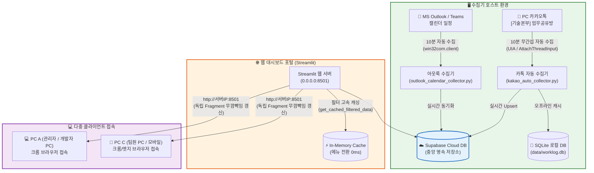

# 🚀 기술본부 카카오톡 & 아웃룩 업무량 및 실시간 관제 대시보드 (v2.5.7)

[](https://github.com/)
[](https://python.org)
[](https://streamlit.io)
[](https://supabase.com)
[-purple.svg)](#-0-단일-진실-소스-시간-표준-single-source-of-truth-timeboranet-kst)
[-success.svg)](#-6-단위-테스트-스위트-unit-test-suite)

카카오톡 `[기술본부] 업무공유방`의 **시작/완료 보고 메시지**와 Microsoft Outlook / Teams의 **캘린더 일정**을 무간섭 자동 수집하여, **과거시(누적 실적 KPI) ➔ 현재시(LIVE 관제) ➔ 미래시(통합 월간 캘린더)**로 이어지는 완벽한 3단계 시간축 모니터링을 제공하는 **Cisco ACI / Catalyst Center 관제 테마 기반 엔터프라이즈 실시간 업무 포털**입니다.

---

## ⏰ 0. 단일 진실 소스 시간 표준 (Single Source of Truth: time.bora.net KST)

- **공식 타임 서버 (NTP)**: `time.bora.net` (LGU+ 한국 표준시 공식 NTP 서버) 영구 고정
- **표준 타임존**: **한국 표준시 (KST, UTC+09:00)**
- **동작 원칙**: 프로젝트 내 모든 실시간 관제 시계, 수집기 타임스탬프, DB 만료 판정, 업무 시간차 연산은 `src.common.time_utils`의 `get_current_kst_time()`을 통해 **KST 기준 Tz-Naive 객체**로 단일화되어 시차 왜곡 및 `TypeError`가 원천 차단됩니다. (상세: [TIME_STANDARD_GUIDE.md](worktime_dashboard/TIME_STANDARD_GUIDE.md) 참조)

---

## 🌟 1. 핵심 아키텍처 & 수집 파이프라인

### 1.1 현재 데이터 수집 및 동기화 구조 (v2.5.6)

```mermaid
flowchart TD
    subgraph HostServer["🖥️ 수집기 호스트 환경"]
        K["💬 PC 카카오톡\n[기술본부] 업무공유방"] -->|"10분 무간섭 자동 수집\n(UIA / AttachThreadInput)"| KakaoCollector["카톡 자동 수집기\n(kakao_auto_collector.py)"]
        O["📅 MS Outlook / Teams\n캘린더 일정"] -->|"10분 자동 수집\n(win32com.client)"| OutlookCollector["아웃룩 수집기\n(outlook_calendar_collector.py)"]
        
        KakaoCollector -->|"실시간 Upsert"| CloudDB[("☁️ Supabase Cloud DB\n(중앙 영속 저장소)")]
        OutlookCollector -->|"실시간 동기화"| CloudDB
        
        KakaoCollector -->|"오프라인 캐시"| LocalDB[("💾 SQLite 로컬 DB\n(data/worklog.db)")]
    end

    subgraph WebPortal["🌐 웹 대시보드 포털 (Streamlit)"]
        Server["Streamlit 웹 서버\n(0.0.0.0:8501)"] --> CloudDB
        Server -->|"필터 고속 캐싱\n(get_cached_filtered_data)"| MemoryCache[("⚡ In-Memory Cache\n(메뉴 전환 0ms)")]
    end

    subgraph Clients["💻 다중 클라이언트 접속"]
        ClientA["💻 PC A (관리자 / 개발자 PC)\n크롬 브라우저 접속"]
        ClientC["👥 PC C (팀원 PC / 모바일)\n크롬/엣지 브라우저 접속"]
    end

    Server -->|"http://서버IP:8501\n(독립 Fragment 무깜빡임 갱신)"| ClientA
    Server -->|"http://서버IP:8501\n(독립 Fragment 무깜빡임 갱신)"| ClientC

    style HostServer fill:#e8f5e9,stroke:#2e7d32,stroke-width:2px
    style CloudDB fill:#e3f2fd,stroke:#1565c0,stroke-width:2px
    style WebPortal fill:#fff3e0,stroke:#e65100,stroke-width:2px
    style Clients fill:#f3e5f5,stroke:#7b1fa2,stroke-width:2px
```

### 1.2 차기 인프라 전환 로드맵 (안드로이드 공기계 스마트폰 수집)
사내 리눅스 VM 환경의 Windows 라이선스 감사(Audit) 리스크를 100% 원천 해소하기 위해, 차기 수집 인프라는 **안드로이드 공기계 스마트폰 + 웹 서버 파이프라인**으로 전환을 준비하고 있습니다:

```
[안드로이드 공기계 스마트폰]
- Wi-Fi 및 상시 전원 연결
- 카카오톡 [기술본부] 방 상시 수신
- 메신저봇R (알림 감지 및 웹훅 발송)
       │
       ▼ (HTTP POST JSON)
[사내 리눅스 VM 수신 웹 서버 (FastAPI/Flask)]
- 수집 페이로드 수신 및 파싱 검증
       │
       ▼ (Upsert)
[☁️ Supabase Cloud DB] ──▶ [🌐 Streamlit 웹 대시보드]
```
> **진행 현황**: 스마트폰 단말 준비 후 다음 주 구축 및 현장 투입 예정 (현재는 기존 Windows 수집기 정상 가동 유지).

---

## 🧭 2. 대시보드 3단계 시점 편성 (과거시 ➔ 현재시 ➔ 미래시)

화면 배치는 사용자의 인지 흐름에 맞추어 **과거시에서 미래시로 자연스럽게 전개**됩니다:

```
┌─────────────────────────────────────────────────────────────┐
│ 1. [과거시] 핵심 KPI 5대 지표 & 근무 실적 통계             │
│    - 총 투입 시간, 작업 건수, 투입 인원, 긴급 작업, 초과율  │
├─────────────────────────────────────────────────────────────┤
│ 2. [과거~현재] 주 40h / 52h 근무 시간 알림 배너             │
│    - 52h 초과 시 🚨 위험 경고 / 40~51h 주의 모니터링        │
├─────────────────────────────────────────────────────────────┤
│ 3. [현재시] LIVE 관제: 오늘 실시간 작업 및 부재 현황        │
│    - 🏖️ 휴가/부재 현황 (18:00 기준 자동 전환)               │
│    - ⏳ 진행 중인 작업 (09:00 정각 도달 시 LIVE 승격)       │
│    - 📅 오늘 예정 일정 (카톡/아웃룩 중복 배제)              │
│    - ✅ 오늘 완료된 작업 (1분 자동 갱신 칸반/그리드)         │
├─────────────────────────────────────────────────────────────┤
│ 4. [미래시] 월간캘린더 통합 일정표 (동기화: 아웃룩&Teams)   │
│    - 전 팀원 미래 스케줄 고대비 7색 스펙트럼 월간 캘린더    │
└─────────────────────────────────────────────────────────────┘
```

---

## 🖥️ 3. 12대 화면 메뉴 및 인터페이스 구조

본 시스템은 역할 기반 접근 제어(RBAC)가 적용된 **12대 특화 메뉴 화면**을 제공합니다:

| 메뉴 대분류 | 세부 메뉴명 | 접근 권한 | 주요 기능 및 역할 |
| :--- | :--- | :---: | :--- |
| **🏠 메인 관제** | **실시간 분석 대시보드** | 전체 공개 | KPI 5대 지표, 주 40h/52h 모니터링, 3단 LIVE 관제, 월간 캘린더 위젯 통합 뷰 |
| **⚙️ 관리** | **팀원 소속 및 직급 관리** | 관리자 | 팀 생성/삭제, 팀원 팀 배정, 직급(사원~수석) 매핑 관리 |
| | **작업 기록 원장 & 엑셀** | 관리자 | 전체 수집 로우 데이터 테이블 그리드 조회 및 엑셀 다운로드 |
| **📊 분석** | **작업 캘린더 & 밀도 히트맵** | 전체 공개 | 월간 일별 투입 시간 및 작업 밀도 히트맵 시각화 |
| | **전체 작업 스마트 검색** | 전체 공개 | 작업자, 고객사, 내용 키워드 기반 다차원 고속 검색 |
| | **Summary** | 전체 공개 | 실적 요약, 엑셀 리포트 다운로드, 주간 메일 발송, Gemini AI 브리핑 |
| | **팀원별 업무량 분석** | 전체 공개 | 팀원별 투입 공수, 지원 고객사 순위, 주차별 근무 추이 분석 |
| | **팀별 업무량 비교** | 전체 공개 | 팀 간 공수 비교, 파레토 차트, 비중 분석 |
| | **월별/일별 추이** | 전체 공개 | 장기 공수 트렌드 및 요일별/시간대별 패턴 분석 |
| | **고객사별 공수 분포** | 전체 공개 | 상위 고객사 집중도 및 지원 패턴 파레토 분석 |
| | **예정 vs 실제 소요시간** | 전체 공개 | 예상 시간 대비 실제 소요 시간 편차 및 예측 정확도 분석 |
| **💰 비용산정** | **예상 비용산정 대시보드** | 관리자 | 직급별 단가 기반 청구 금액 산정, 시간 직접 수정 장표 및 감사 이력 |
| **🛠️ 시스템 관리** | **공휴일/메일/계정 관리** | 최고관리자 | 법정/임시 공휴일 관리, 정기 메일 대상 설정, 관리자 계정 관리, 전역 캐시 초기화 |

---

## 🎯 4. 세부 판정 내역 및 비즈니스 로직 (Decision Rules)

### 4.1 09:00 정각 LIVE 관제 승격 정책 & 예정 일정 중복 배제 (v2.5.2)
- **정각 승격 원칙**: 기존 시작 30분 전 사전 승격 로직(`st_dt - 30분`)을 전면 폐지하고, 시작 시각 이전(`now < st_dt`)에는 무조건 하단 **"오늘 예정 일정 (SCHEDULED)"**에 대기합니다.
- **정각 도달 승격**: 현재 시각이 작업 시작 시각(**09:00 정각**)에 도달한 순간에만 상단 **"진행 중인 작업 (PENDING)"** 카드로 즉시 승격됩니다.
- **상하단 중복 원천 차단**:
  - 고객사명 정규화(`src/services/client_normalizer.py`: 예: 대구은행 ➔ IM뱅크)를 적용하여 표기 불일치로 인한 오탐을 방지합니다.
  - 카카오톡 시작 건과 아웃룩 예정 일정이 동일 작업자/고객사/시간대로 중복되는 경우, 상단에 진행 중 카드가 존재하면 하단 예정 일정 목록에서 자동 제외합니다.
  - `home_view.py`의 시작 전 작업 강제 재배치 및 상하단 배타성 안전망(Safety Guard)으로 동일 카드의 중복 노출을 100% 방지합니다.

### 4.2 출처(Source) 판정 및 화면 뱃지 표출 규칙
작업 데이터의 발생 경로에 따라 실시간 카드 및 완료 카드에 출처 뱃지가 부여됩니다:

| 출처 유형 | 판정 기준 | 전체 팀 뷰 (5열 좁은 화면) | 단일 팀 뷰 (4열 넓은 화면) | 뱃지 디자인 사양 |
| :--- | :--- | :---: | :---: | :--- |
| **카카오톡** | 카카오톡 업무공유방 파싱 데이터 | **`K`** | **`💬 카톡`** | `#FEE500` 노란색 배경, `#371d1e` 다크브라운 폰트, 볼드 |
| **아웃룩/Teams**| MS Outlook / Teams 캘린더 동기화 데이터 (`is_outlook=True`) | **`O`** | **`📅 아웃룩`** | `#0284c7` 블루 배경, `#ffffff` 화이트 폰트, 볼드 |
| **휴가/연차** | `is_leave=True` 또는 '휴가/연차/반차' 키워드 포함 건 | **`🏖️`** | **`🏖️ 휴가`** | `#f3e8ff` 연보라 배경, `#7e22ce` 보라 폰트 |

- **듀얼 뱃지 표출**: 동일 일정이 카톡과 아웃룩 양쪽에 모두 등록된 경우, DB 무결성을 위해 두 출처 데이터를 모두 보존하면서 카드에 **`[K][O]`(단일 팀: `[💬 카톡][📅 아웃룩]`) 듀얼 뱃지**를 동시 표출합니다.
- **화면 찌그러짐 방지**: 카드 폭 축소 시 텍스트 꺾임을 막기 위해 `white-space: nowrap`, `flex-shrink: 0` 속성을 모든 뱃지에 강제 적용합니다.

### 4.3 휴가/부재 카드 18:00 자동 전환 규칙
- **근무 시간대 (18:00 이전)**: 실시간 진행 영역 최상단 부재 배너에만 100% 카드로 표출 (오늘 완료된 작업 영역에는 중복 표출되지 않음).
- **퇴근 시간대 (18:00 이후)**: 실시간 상단 부재 영역에서 자동 숨김 처리되고, **"오늘 완료된 작업"** 영역으로 자연스럽게 이동하여 표출됩니다.

### 4.4 시간 상태 및 특수 근무 판정 규칙
1. **시작 시간 표기**:
   - 카톡 시작 건: **`시작보고 HH:MM`** (예: `시작보고 08:30`)
   - 아웃룩 일정 건: **`일정시작 HH:MM`** (예: `일정시작 09:00`)
2. **야간 작업 (`🌙 야간`) 판정**:
   - 작업 시작 시각이 **18:00 ~ 익일 06:00** 사이이거나 메시지에 `[야간]` 태그가 명시된 경우.
3. **주말 작업 (`🏖️ 주말`) 판정**:
   - 작업 일자가 **토요일(Saturday)**, **일요일(Sunday)** 또는 시스템에 등록된 **법정/임시 공휴일**인 경우.
4. **예정 시간 초과 (`⚠️ 초과`) 판정**:
   - `현재 시각(KST) - 작업 시작 시각 > 예정 시간(estimated_hours)` 인 경우 즉시 점등.
   - 프로그레스 바 100% 도달 후 붉은색 경고 점등 및 경과 시간 붉은색 볼드 처리.
5. **마우스 오버 툴팁 (Hover Tooltip)**:
   - 말줄임표(`...`) 처리된 긴 고객사명이나 작업 내용에 마우스를 올리면 `title` 속성으로 원문 전체 즉시 노출.

### 4.5 과중 근무 (주 40h / 52h) 2단계 알림 판정 규칙
- **법정 실근로시간 공제 원칙**: 카카오톡 `[교육]` 태그 건 및 `[휴가/연차]` 건은 일반 활동 통계에는 기록되나, **주 40h/52h 법정 근로시간 산정에서는 100% 자동 제외(공제)**됩니다.
- **1단계: 주 40h ~ 51.9h (주의)**: `⚠️ [근무 시간 경고]` 주황색 배너 및 `⚠️ 팀원명(주차:XX.Xh)` 주황색 버튼 칩 표출.
- **2단계: 주 52h 이상 (위험)**: `🚨 [과중 근무 발생 알림]` 붉은색 네온 사이렌 배너 및 `🚨 팀원명(주차:XX.Xh)` 강조 버튼 표출.
- **보상 휴가 연동**: 초과 근무에 대해 보상휴가가 승인된 건은 `✅ 보상 완료` 초록색 칩으로 전환.

### 4.6 페이지 전환 속도 최적화 & 사이드바 UI (v2.5.1 ~ v2.5.7)
- **필터 고속 캐싱 (`get_cached_filtered_data`)**: `@st.cache_data`를 적용하여 사용자가 메뉴를 전환할 때 이미 계산된 데이터프레임을 0ms로 즉시 반환합니다.
- **비데이터 화면 지연 연산 (Lazy Evaluation)**: 공휴일 관리, 계정 관리, 정기 메일 설정 등 `NON_DATA_PAGES`에 진입할 때는 대용량 데이터 필터링을 완전 건너뜁니다.
- **사이드바 UI 정돈 및 80px 스페이서 배치 (`v2.5.7`)**:
  - 미로그인 상태에서 인지 부하를 주던 `[게스트 모드]` 카드를 제거하고, 로그인 시에만 관리자 권한 카드를 노출합니다.
  - `🔑 관리자 로그인` 버튼이 뷰포트 크기에 구애받지 않고, **맨 아래 메뉴 기준 적절한 여백인 80px 아래(`sidebar-footer-spacer`)에 안정적으로 위치**하도록 정돈했습니다.
  - 중복 구분선(`border-top`)을 제거하여 미니멀하고 정갈한 사이드바를 유지합니다.

---

## 📁 5. 프로젝트 디렉토리 구조

```
PublicRepo/
├── worktime_dashboard/             # 대시보드 핵심 소스코드 및 리소스
│   ├── data/                       # 로컬 데이터 및 오프라인 SQLite 캐시
│   ├── src/
│   │   ├── auth/                   # 인증 및 보안 계층 (RBAC, 브루트포스 방어)
│   │   ├── collector/              # 10분 무간섭 자동 수집기 (카톡 UIA / 아웃룩 MAPI)
│   │   ├── common/                 # 공통 유틸리티 (time.bora.net NTP KST 엔진)
│   │   ├── config.py               # 전역 환경설정
│   │   ├── database/               # Supabase Cloud DB & SQLite 영속성
│   │   ├── parser/                 # 카톡 메시지 파싱 및 시작-완료 매칭
│   │   ├── services/               # 비즈니스 로직 (AI 브리핑, 정규화, 스케줄 동기화 등)
│   │   └── dashboard/              # Streamlit 프론트엔드 (app.py, styles.css, 12대 뷰)
│   ├── tests/                      # 단위 테스트 스위트 (25개 테스트)
│   └── requirements.txt            # Python 의존성 목록
├── update_and_run.bat              # 최신 Git 동기화 & 대시보드 통합 실행
├── run_dashboard.bat               # 대시보드 단독 실행
├── run_collector.bat               # 카카오톡 수집기 단독 실행
├── collect_outlook_now.bat         # 아웃룩 1회 즉시 수집
└── README.md                       # 통합 기술 및 운영 명세서
```

---

## 🧪 6. 단위 테스트 스위트 (Unit Test Suite)

본 시스템은 안정적인 프로덕션 운영을 위해 핵심 비즈니스 로직에 대해 **총 25개 단위 테스트**를 상시 유지합니다.

### 6.1 테스트 실행 방법
```bash
# 루트 또는 worktime_dashboard 디렉토리에서 실행
python -m unittest discover worktime_dashboard/tests
```

### 6.2 테스트 커버리지 영역
1. **인증 및 보안 (`test_auth_manager.py`, 4건)**: 비밀번호 해싱 검증, 로그인 성공/실패 처리, 브루트포스 5회 실패 시 5분 계정 잠금 가드.
2. **고객사 정규화 (`test_client_normalizer.py`, 4건)**: 금융권 명칭(대구은행 ➔ IM뱅크 등), 법인격 표기 제거, 공백 표준화.
3. **데이터 필터 캐싱 (`test_data_filter_cache.py`, 5건)**: `get_cached_filtered_data()` 팀/월/직급/야간 필터링 정확도 및 빈 데이터 안전성.
4. **메시지 파싱 (`test_kakao_parser.py`, 5건)**: 단발성/다일 작업 파싱, 시간 단위 정규화, 다중 작업자 분할.
5. **야간/주말 판정 (`test_night_weekend.py`, 4건)**: 18시 이후 야간 작업 분류, 공휴일/주말 근무 판정.
6. **일정 동기화 & 정각 승격 (`test_schedule_sync.py`, 3건)**: 09:00 이전 예정 일정 유지, 09:00 정각 LIVE 승격, 카톡-아웃룩 중복 제거.

---

## 🛠️ 7. 실행 및 운영 가이드

### 7.1 환경 요구사항
- **운영체제**: Windows 10 / 11 (수집기 가동 환경)
- **Python 버전**: Python 3.10 이상
- **의존성 설치**:
  ```bash
  pip install -r worktime_dashboard/requirements.txt
  ```

### 7.2 실행 스크립트 안내
| 파일명 | 실행 목적 | 설명 |
| :--- | :--- | :--- |
| **`update_and_run.bat`** | **최신 동기화 & 통합 실행** | 최신 Git 커밋 동기화 확인 후 Streamlit 웹 서버 실행 (권장) |
| **`run_dashboard.bat`** | **대시보드 단독 실행** | 백그라운드 수집 데몬 포함 대시보드 웹 서버 단독 기동 |
| **`run_collector.bat`** | **수집기 단독 실행** | 카카오톡 10분 무간섭 자동 수집기 단독 기동 |
| **`collect_outlook_now.bat`** | **아웃룩 즉시 수집** | 아웃룩 캘린더 일정을 즉시 1회 수집하여 Supabase DB 동기화 |
